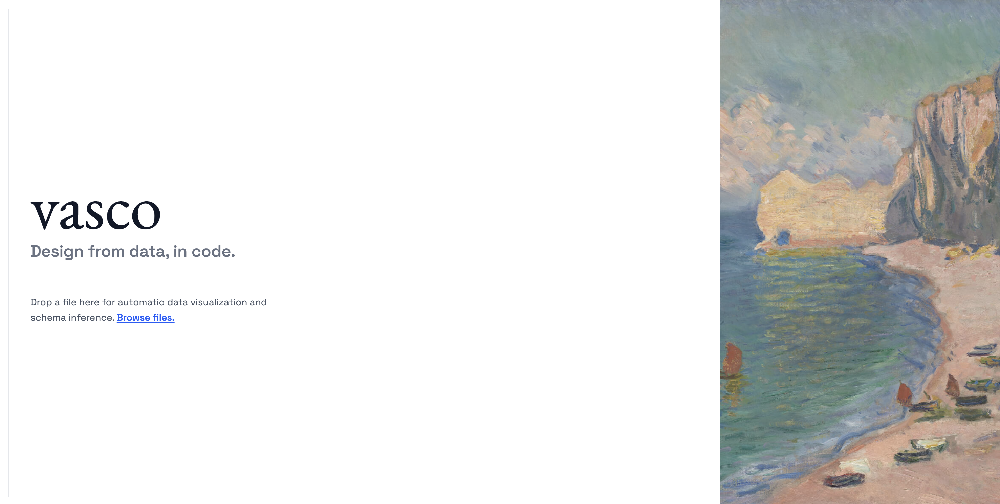
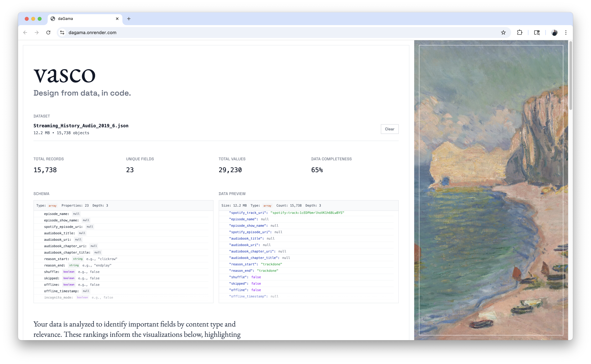
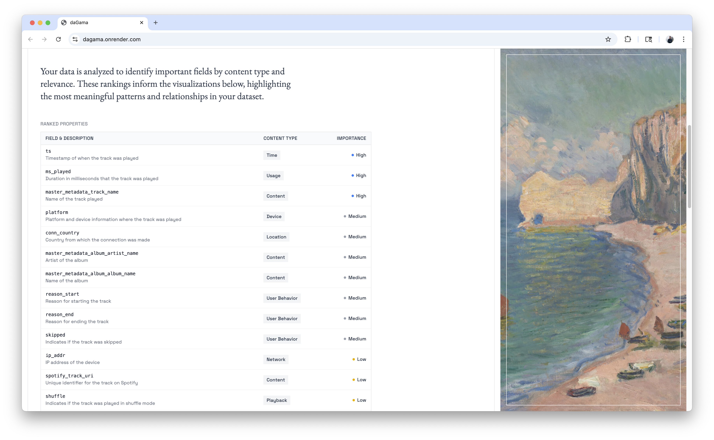
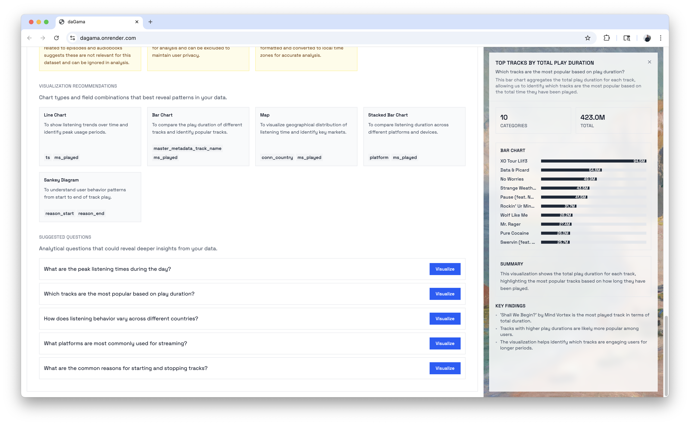
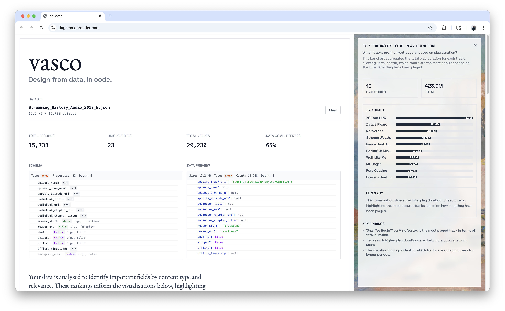
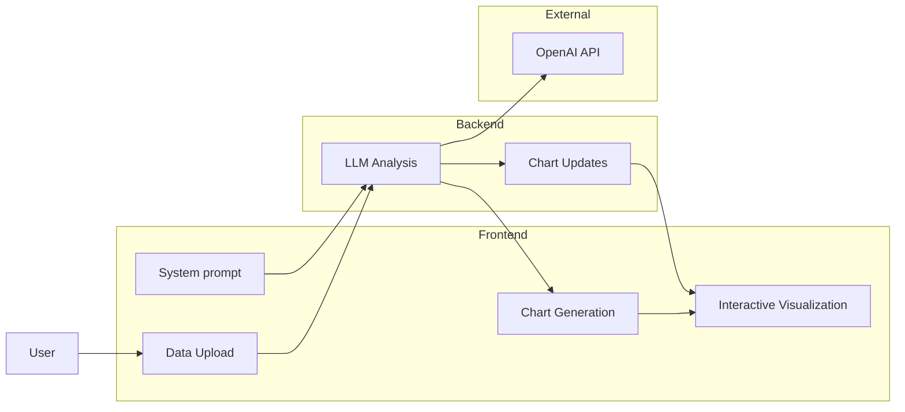

# vasco (daGama)

> Design from data, in code.

## Overview

An LLM-assisted interface that transforms the "blank canvas" problem into an intuitive data exploration experience. Users can upload datasets, get LLM-driven analysis of semantic meaning, and get suggestions for visualizations.

The motivation was personal: I wanted to quickly explore data and guide design decisions.

## Gallery







## Challenges

- Be able to parse a large data file and returns insights quickly.
- Provide the LLM with important metadata and context, since sending the entire file is not feasible.

## Architecture



## Tech Stack

### Frontend

- **React** - UI framework
- **TailwindCSS** - Styling
- **TanStack Query** - Data fetching and caching
- **tRPC** - Type-safe API client
- **AI SDK React** - LLM integration

### Backend

- **Bun** - Runtime and package manager
- **Hono** - Web framework
- **tRPC** - Type-safe API server
- **OpenAI API** - LLM integration
- **Zod** - Schema validation

## Core Features

### Data Ingestion

- Drag-and-drop JSON upload
- Automatic schema inference

### AI-Powered Visualization

- LLM analyzes data structure and relationships
- Generates contextual chart suggestions
- Provides insights in natural language

### Interactive Refinement

- Natural language chart modifications
- Live preview of changes
- Transparent configuration updates

## Demo Flow

1. **Upload**: User drops a dataset (e.g., transportation data)
2. **Analyze**: LLM examines schema and suggests relevant visualizations
3. **Generate**: User selects a chart type, system renders live visualization

## Design Principles

- **Data-Driven Design**: UI components generated from actual data structure
- **Human-in-the-Loop**: LLM provides suggestions, user maintains control
- **Transparency**: Expose schema analysis, LLM reasoning, and configuration changes
- **Iterative**: Support continuous refinement through natural language

## Future Work

- **MCP**: Use MCP to provide tools for external data (e.g., APIs for content)
- **More direct user feedback**: Allow users to provide feedback on the analysis and visualizations, allowing suggestions and charts to be re-generated

---

## Running the project

First, create a `.env` file in the root directory with the following variables:

```bash
OPENAI_API_KEY=your_openai_api_key
```

### Local development

```bash
# Install dependencies
bun install

# Start development server
bun dev

# Build for production
bun run build

# Start the server for production
bun start
```

### Production build

```bash
# Build for production
bun run build

# Start the server for production
bun start
```
